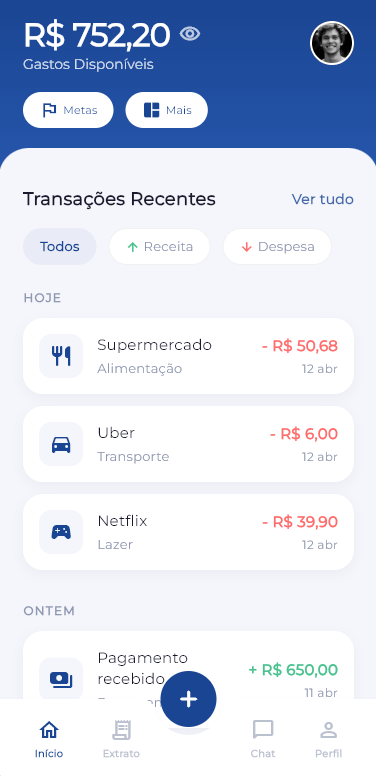
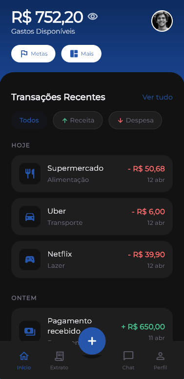
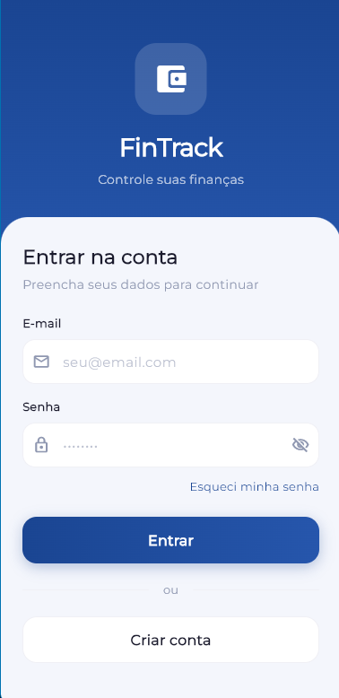
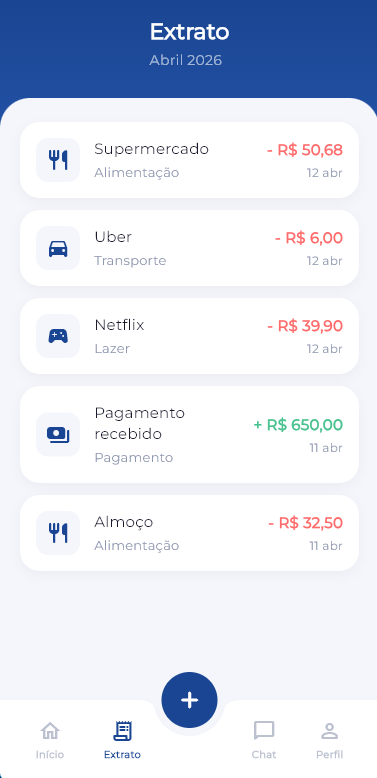
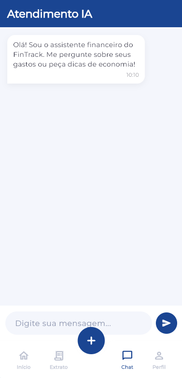
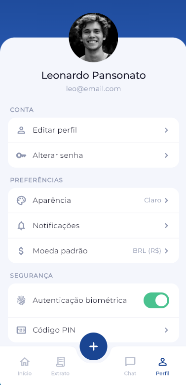

# FinTrack

Aplicativo de controle financeiro pessoal desenvolvido em Flutter.
O foco é oferecer uma experiência simples e direta pra acompanhar gastos, receitas e ter visibilidade do seu dinheiro no dia a dia.

<p align="center">
  
   <!-- space -->
   &nbsp;&nbsp;&nbsp;&nbsp;
  
</p>

## Funcionalidades

- **Dashboard** com saldo disponível e transações recentes agrupadas por dia
- **Extrato** completo com histórico de movimentações
- **Chat IA** para atendimento e dúvidas financeiras
- **Perfil** com configurações de conta, aparência (dark/light/system), segurança e preferências
- **Filtros** por tipo de transação (receita/despesa)
- **Ocultação de valores** com um toque, pra usar em público sem stress
- Suporte a **tema claro e escuro**
- Formatação monetária em **Real (BRL)** com padrões brasileiros

## Screenshots

| Login | Home | Extrato | Chat | Perfil |
|:-----:|:----:|:-------:|:----:|:------:|
|  |  |  |  |  |

## Stack

| Camada | Tecnologia |
|--------|-----------|
| Framework | Flutter 3.11+ / Dart |
| Tipografia | Google Fonts (Montserrat) |
| Tema | ThemeExtension customizado com suporte dark/light |
| Estado | Provider + StatefulWidget |
| Persistência | SharedPreferences (tema) |
| Plataformas | Android, iOS, Web, Windows, Linux, macOS |

## Estrutura do projeto

```
lib/
├── models/
│   └── gasto.dart            # Modelo de transação (receita/despesa)
├── providers/
│   └── theme_provider.dart   # Notifier de tema (claro/escuro/sistema)
├── screens/
│   ├── login_screen.dart     # Tela de login
│   ├── main_shell.dart       # Shell com bottom nav + FAB
│   ├── home_screen.dart      # Dashboard principal
│   ├── extrato_screen.dart   # Histórico de transações
│   ├── chat_screen.dart      # Chat com assistente IA
│   └── perfil_screen.dart    # Configurações e perfil
├── utils/
│   ├── constants.dart        # Paleta de cores e constantes
│   └── formatters.dart       # Formatação BRL e datas
├── widgets/
│   ├── gasto_card.dart       # Card de transação
│   └── chat_bubble.dart      # Mensagem do chat
├── app.dart                  # MaterialApp, rotas e temas
└── main.dart                 # Entry point
```

## Rodando o projeto

```bash
# Instalar dependências
flutter pub get

# Rodar no dispositivo/emulador conectado
flutter run

# Análise estática
flutter analyze

# Testes
flutter test
```

## Requisitos

- Flutter SDK `^3.11.4`
- Dart SDK compatível
- Dispositivo/emulador ou navegador pra rodar

## Licença

Projeto pessoal. Todos os direitos reservados.
