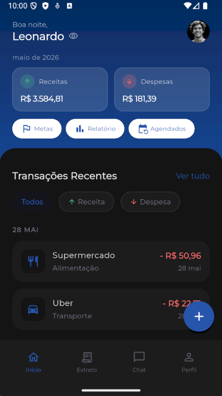
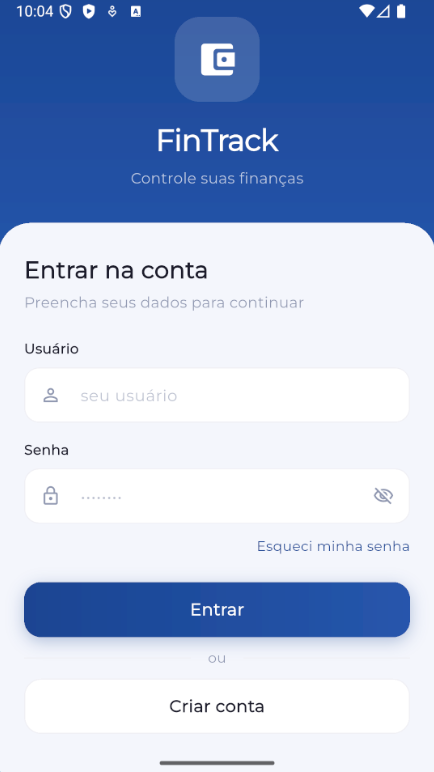
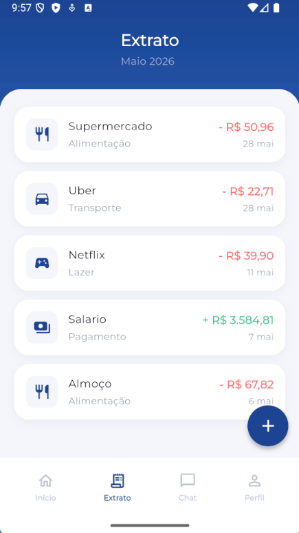

# FinTrack

Aplicativo de controle financeiro pessoal desenvolvido em Flutter.
O foco é oferecer uma experiência simples e direta pra acompanhar gastos, receitas e ter visibilidade do seu dinheiro no dia a dia.

<p align="center">
  
   <!-- space -->
   &nbsp;&nbsp;&nbsp;&nbsp;
  
</p>

## Funcionalidades

- **Resumo mensal** no header com cards de receitas e despesas do mês corrente
- **Saudação dinâmica** (bom dia / boa tarde / boa noite) com ocultação de valores
- **Dashboard** com transações recentes agrupadas por dia e filtros por tipo
- **Extrato** completo com histórico de movimentações
- **Cadastro de transações** com título, valor, categoria e data
- **Editar e excluir** transações diretamente pelo card (tap abre o formulário)
- **Chat IA** para atendimento e dúvidas financeiras
- **Perfil** com configurações de conta, aparência e preferências
- **Tema claro / escuro / sistema** com persistência local
- **Moeda padrão** configurável (BRL, USD, EUR) com persistência local
- **Transações vinculadas ao usuário** — cada conta vê apenas seus próprios dados
- **Ocultação de valores** com um toque, pra usar em público sem stress
- Formatação monetária em **Real (BRL)** com padrões brasileiros

## Screenshots

| Login | Home | Extrato | Chat | Perfil |
|:-----:|:----:|:-------:|:----:|:------:|
|  |  |  |  |  |

## Stack

| Camada | Tecnologia |
|--------|-----------|
| Framework | Flutter 3.11+ / Dart |
| Tipografia | Google Fonts (Montserrat) |
| Tema | ThemeExtension customizado com suporte dark/light |
| Estado | Provider + ChangeNotifier |
| Autenticação | JWT via Keycloak, SecureTokenStorage |
| Persistência local | SharedPreferences (tema + moeda), sqflite (transações) |
| Armazenamento seguro | flutter_secure_storage (JWT/tokens) |
| Plataformas | Android, iOS, Web, Windows, Linux, macOS |

## Estrutura do projeto

```
lib/
├── database/
│   └── db_helper.dart                  # SQLite — criação e migração da tabela de transações
├── models/
│   ├── auth_session.dart               # Sessão autenticada (JWT, userId via sub)
│   └── gasto.dart                      # Modelo de transação (receita/despesa)
├── providers/
│   ├── auth_provider.dart              # Estado de autenticação (login/logout/restore)
│   ├── preferences_provider.dart       # Preferências do usuário (moeda padrão)
│   └── theme_provider.dart             # Notifier de tema (claro/escuro/sistema)
├── repositories/
│   ├── auth_repository.dart            # Interface de autenticação
│   ├── auth_repository_impl.dart       # Implementação com API
│   ├── chat_repository.dart            # Interface do chat IA
│   ├── chat_repository_impl.dart       # Implementação com API
│   ├── gasto_repository.dart           # Interface de transações
│   └── gasto_repository_impl.dart      # Implementação com SQLite
├── screens/
│   ├── auth_gate.dart                  # Roteamento autenticado/não autenticado
│   ├── chat_screen.dart                # Chat com assistente IA
│   ├── editar_transacao_screen.dart    # Editar/excluir transação existente
│   ├── extrato_screen.dart             # Histórico completo de transações
│   ├── home_screen.dart                # Dashboard com resumo mensal
│   ├── login_screen.dart               # Tela de login
│   ├── main_shell.dart                 # Shell com bottom nav + FAB
│   ├── nova_transacao_screen.dart      # Cadastro de nova transação
│   └── perfil_screen.dart              # Configurações e perfil
├── services/
│   ├── api_client.dart                 # Cliente HTTP com interceptor de token
│   └── secure_token_storage.dart       # Leitura/gravação segura do JWT
├── utils/
│   ├── constants.dart                  # Paleta de cores e constantes
│   └── formatters.dart                 # Formatação BRL e datas
├── widgets/
│   ├── chat_bubble.dart                # Mensagem do chat
│   └── gasto_card.dart                 # Card de transação (swipe p/ excluir, tap p/ editar)
├── app.dart                            # MaterialApp, rotas e temas
└── main.dart                           # Entry point e injeção de dependências
```

## Rodando o projeto

```bash
# Instalar dependências
flutter pub get

# Rodar no dispositivo/emulador conectado
flutter run

# Análise estática
flutter analyze

# Testes
flutter test
```

## Requisitos

- Flutter SDK `^3.11.4`
- Dart SDK compatível
- Dispositivo/emulador ou navegador pra rodar
- Arquivo `.env` na raiz com `SISTEMA_ID` configurado

## Licença

Projeto pessoal. Todos os direitos reservados.
